# 🧪 Local LLM Test Case Generator

A secure, local-first application that generates professional QA test suites from feature requirements using **Ollama** and **Python**. No data leaves your machine.

---

## 🏗️ Architecture Diagram

```mermaid
flowchart TB
    Start([👤 User Opens App]) --> UI[🌐 Streamlit UI Loads]
    UI --> Input{User Enters<br/>Feature Requirement}
    
    Input -->|Example: Login with 2FA| Validate[✅ Input Validation]
    Validate -->|Valid| Prompt[📝 Build Structured Prompt]
    Validate -->|Invalid/Empty| Error1[❌ Show Error Message]
    Error1 --> Input
    
    Prompt --> Backend[⚙️ Backend Generator<br/>generator.py]
    Backend -->|HTTP Request| Ollama[🦙 Ollama API<br/>localhost:11434]
    
    subgraph Local_Machine[🖥️ Local Machine - No Internet Required]
        Ollama -->|Load Model| Model{🧠 LLM Model<br/>gemma3:1b/llama3.2}
        Model -->|Generate| Response[📄 JSON Response]
        Response -->|Validate Schema| Check{Valid JSON?}
        Check -->|No| Retry[🔄 Retry Logic<br/>Max 2 attempts]
        Retry --> Model
        Check -->|Yes| Return[✅ Return Test Suite]
    end
    
    Return --> Parse[🔍 Parse & Structure Data]
    Parse --> Display[🎨 Render UI Components]
    
    Display --> Tab1[👁️ Visual Cards View]
    Display --> Tab2[💻 JSON View]
    Display --> Tab3[📊 Table + CSV Export]
    
    Tab1 --> End([✨ User Reviews Results])
    Tab2 --> End
    Tab3 --> Download[⬇️ Download CSV]
    Download --> End
    
    style Local_Machine fill:#1a1a2e,stroke:#16213e,stroke-width:3px
    style Model fill:#0f3460,stroke:#e94560,stroke-width:2px
    style End fill:#16213e,stroke:#e94560,stroke-width:2px
```



---

## 🚀 Features
*   **100% Local**: Uses Ollama API; no cloud tokens or internet required for generation.
*   **Structured Output**: Generates strict JSON for reliable parsing.
*   **Multi-Model Support**: Switch between `gemma3:1b`, `llama3.2`, `mistral`, etc.
*   **Export Ready**: Download test cases as **CSV** or copy as **JSON**.
*   **Premium UI**: Dark mode, distinct priority badges, and tabbed views.

## 📂 Project Structure
```bash
Project1-LocalTestCaseGenerator/
├── architecture/        # SOPs and Logic Blueprints
├── backend/             # Core Logic
│   ├── generator.py     # Ollama interaction & parsing logic
│   └── requirements.txt # Python dependencies
├── frontend/            # User Interface
│   └── app.py           # Streamlit Application
├── tools/               # Utility Scripts
│   └── verify_ollama.py # Connection Test Script
└── README.md            # Documentation
```

## 🛠️ Prerequisites
1.  **Ollama**: [Download Ollama](https://ollama.com/) and run it.
2.  **Pull a Model**:
    ```bash
    ollama pull gemma3:1b
    # OR
    ollama pull llama3.2
    ```
3.  **Python 3.10+**

## ⚡ Quick Start

1.  **Install Dependencies**
    ```bash
    pip install -r backend/requirements.txt
    ```

2.  **Run the App**
    ```bash
    streamlit run frontend/app.py
    ```

3.  **Generate Tests**
    *   Open `http://localhost:8501`.
    *   Select your model in the sidebar.
    *   Type a requirement (e.g., *"Signup page with email verification"*).
    *   Export your results!

---

## 🛡️ License
MIT
